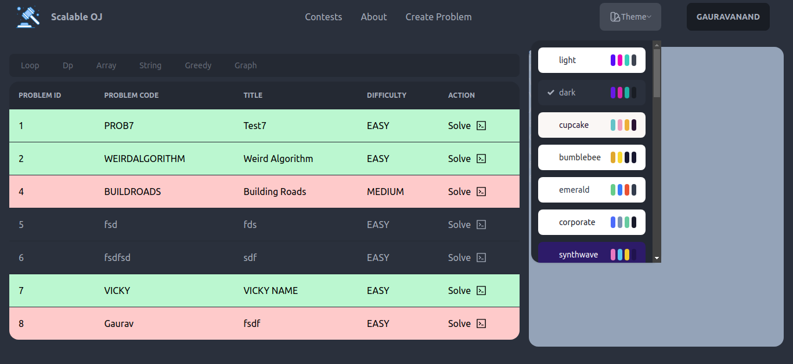
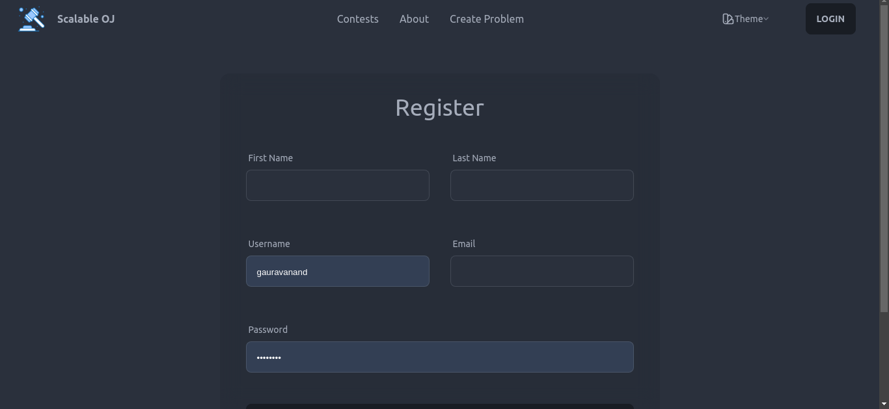
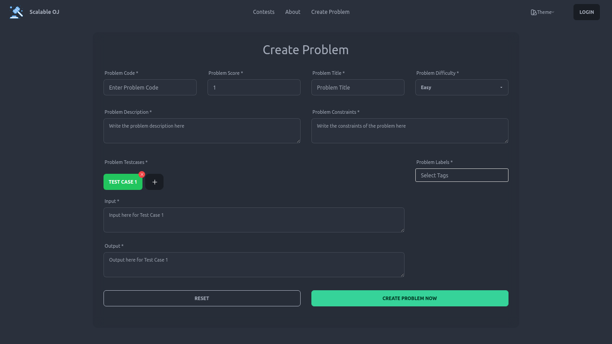
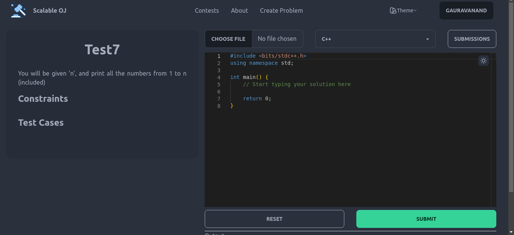

# scalable-oj

A Scalable Online Judge built in Django and React with multiple code execution engine.

# Technology Used

Django, React, Tailwind CSS, Docker, Redis, Celery, Web Scraping.

# About

The project is a problem-solving platform where users can choose problems from a list on the home page. They can sort problems by difficulty level and solved status. Once a problem is selected, users can read its details on the problem page and submit solutions through an input box. They receive a verdict upon submission, and their solutions are visible on the submissions page. The platform offers a concise and precise way for users to engage in problem-solving and track their progress.

# Home Page

# Registration Page

# Create Problem Page

# Problem Solve Page

# Database Schema

# ER Diagram

